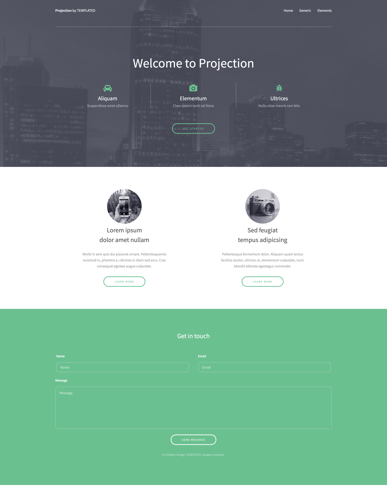

# P217_25-01-21_CSS_Flex-Media_Queries

1. **Flexbox resources to read**
  - https://www.w3schools.com/css/css3_flexbox_items.asp
  - https://www.w3schools.com/css/css3_flexbox_responsive.asp
  
2. **Responsive Web Design**
   - https://www.w3schools.com/css/css_rwd_intro.asp
   - [Why is being responsive important?](https://www.webfx.com/web-design/why-responsive-design-important.html#:~:text=Responsive%20design%20can%20help%20you-ur%20rankings%20in%20search%20engines)
   - [An example of non-responsive website](https://dequeuniversity.com/library/responsive/1-non-responsive)
   - Screen Sizes Map: https://screensizemap.com/
   - [Percentage of mobile users 2020 stats](https://www.broadbandsearch.net/blog/mobile-desktop-internet-usage-statistics)
   - Resolution differences https://en.wikipedia.org/wiki/Display_resolution
   -  At-rules - https://developer.mozilla.org/en-US/docs/Web/CSS/At-rule
   -  @media - https://www.w3schools.com/cssref/css3_pr_mediaquery.asp
   -  @support - https://developer.mozilla.org/en-US/docs/Web/CSS/@supports
   -  Print - https://www.smashingmagazine.com/2011/11/how-to-set-up-a-print-style-sheet/
   -  ```<link rel="stylesheet" media="screen and (min-width: 900px)" href="widescreen.css">```
   
## Assigments:
- **Create below shown layout using Flexbox (define breakpoints by yourself for yourself):**
  
   - 
   
- **Create below shown responsive layout using Flexbox (define breakpoints by yourself for yourself):**


   
## Some usefull resources:
  - https://tobiasahlin.com/blog/common-flexbox-patterns/#stretch-all-fixed-spacing
  - https://github.com/philipwalton/flexbugs
  - http://www.javascriptkit.com/dhtmltutors/cssmediaqueries2.shtml
